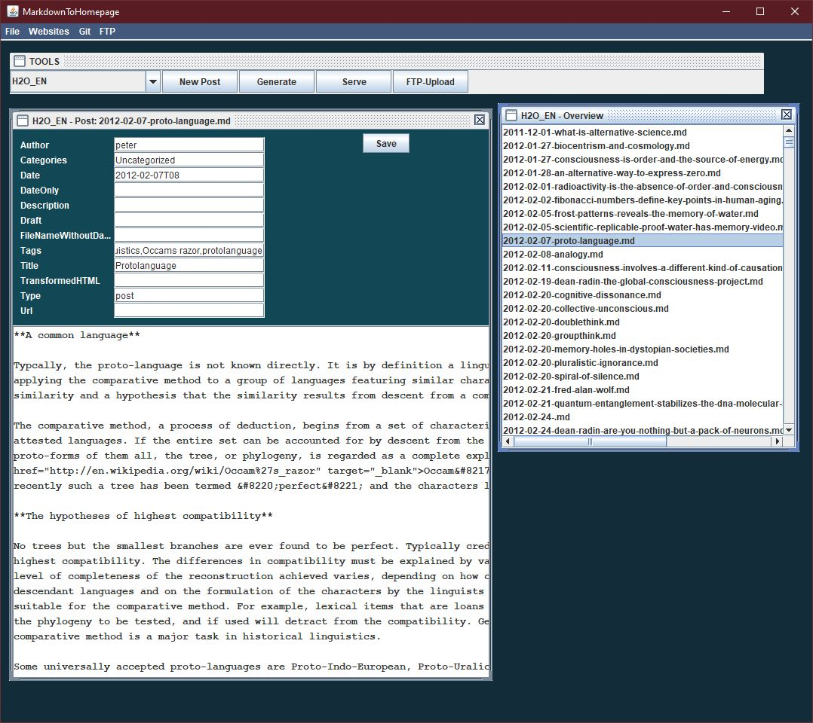

# markdownToHomepage
Markdown to HTML Dynamic Website Generator written entirely in Java and easy to use.

## Modes
### CommandLine Mode
Build with maven:

    mvn clean install

Write a config.json:

    {
      "id" : 0,
      "name" : "My Blog",
      "author" : "John Smith",
      "title" : "My Blog",
      "description" : "Personal Stuff",
      "baseUrl" : null,
      "sourceFolder" : "/myBlog/source",
      "targetFolder" : "/myBlog/public",
      "headerFile" : "/myBlog/templates/header.html",
      "footerFile" : "/myBlog/templates/footer.html",
      "gitUrl" : "https://git...",
      "gitUser" : "user",
      "gitPassword" : "secretOrUseSSH",
      "ftpUser" : "user",
      "ftpPassword" : "secret",
      "ftpHost" : "ftp://...",
      "ftpPort" : 22,
      "ftpRootPath" : "/etc/www/myBlog/"
    }

Then start it with:

    java -jar target/markdowntohomepage-0.0.1-SNAPSHOT.jar [config.json]

Currently I'm working on a Swing Gui, later a Angular 9 Online Gui is planned:

#### Optional: ConfigurationFile
In CommandLine Mode the application does not use Spring's own configuration, but you can define one or use the exisiting application.properties and point towards it (3rd argument).

# Intention:

- Easy to understand, compile and use
- Run anywhere, using as a [command line program](https://projects.spring.io/spring-shell/) or in a server mode ([spring boot](https://spring.io/projects/spring-boot))
- Import Hugo Projects or create a new project from scratch
- Convention over configuration (but ...)
- Configure and use [Git](https://github.com/centic9/jgit-cookbook) repositories
- Configure multiple projects
- JSON Configuration File can be used in ServerMode as also in CommandLineMode
- Add dynamic generated content from [Hugo](https://github.com/gohugoio/hugo) compatible metadata
  - Tags
  - Categories
  - Date and time
  - Youtube or Vimeo Videos
  - [RSS](https://rometools.github.io/rome/) and [sidemap](https://github.com/dfabulich/sitemapgen4j)
  - [JS Search Engine](https://github.com/weixsong/elasticlunr.js)
- [FTP Upload](https://commons.apache.org/proper/commons-net/)
